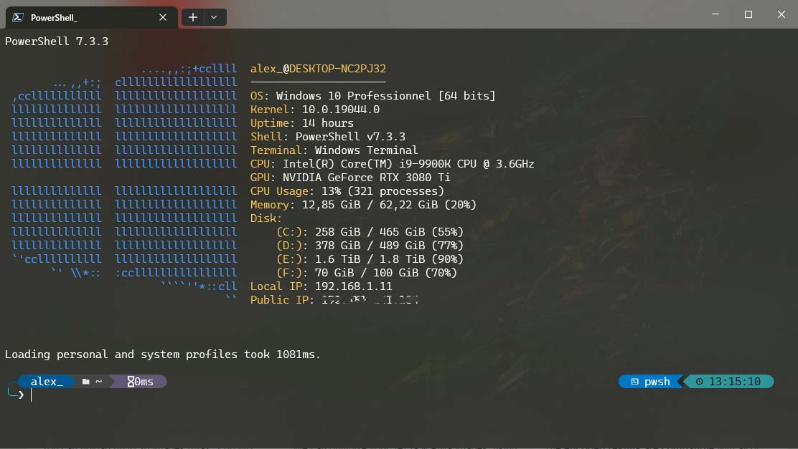

# pwsh-profile



<br>

## Installation automatique

```console
(Invoke-WebRequest "https://raw.githubusercontent.com/ZephyrOff/pwsh-profile/main/install.ps1" -UseBasicParsing).Content | Invoke-Expression
```
<br>

## Installation manuelle

### Copie des configuration

Faire $profile pour identifier le dossier profile Windows PowerShell
```console
$profile
```

Dans ce dossier:
- créé le dossier wallpapers et copier background.jpg qui se trouve dans le dossier terminal
- copier le dossier AddOn qui se trouve dans le dossier pwsh
- copier le fichier Microsoft.PowerShell_profile.ps1 qui se trouve dans le dossier pwsh
- créé le dossier apps
- copier dans le dossier apps le fichier perso.omp.json qui se trouve dans le dossier oh-my-posh
- copier dans le dossier apps le fichier config.ps1 qui se trouve dans le dossier winfetch et le renommer winfetch_conf.ps1

<br>

### Installation des fonts

Copier le contenu du dossier fonts dans __*$env:USERPROFILE+"\AppData\Local\Microsoft\Windows\Fonts\"*__ et installer chaque police.

<br>

### Installation de oh-my-posh

```console
Set-ExecutionPolicy Bypass -Scope Process -Force; Invoke-Expression ((New-Object System.Net.WebClient).DownloadString('https://ohmyposh.dev/install.ps1'))
Install-Module -Name Terminal-Icons -Repository PSGallery -Scope CurrentUser
```

<br>

### Installation de winfetch

Télécharger le [fichier](https://raw.githubusercontent.com/lptstr/winfetch/master/winfetch.ps1) et le placer dans le dossier apps du profil powershell

<br>

### Configuration de Windows Terminal

Récupérer le contenu du fichier [settings.json](https://raw.githubusercontent.com/ZephyrOff/pwsh-profile/main/terminal/settings.json) et le mettre à la place du settings.json de Windows Terminal


## Configuration des informations

Dans le fichier Microsoft.PowerShell_profile.ps1, plusieurs paramètres sont à configurer.

__$user__ définit l'utilisateur qui sera utilisé par défaut avec les commande sh, sshk et invoke
<br>
__$dmz_network__ définit l'ip du réseau pour forcer la connexion en root
<br>
__$ssh_key__ définit l'emplacement de la clé privée pour la connexion avec la commande sshk
